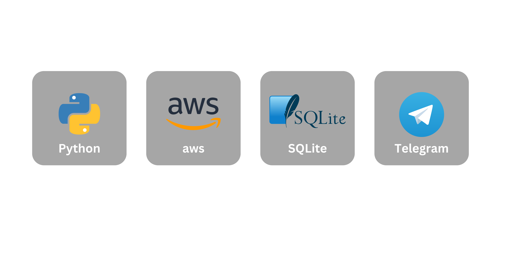

# Why start this project?

I have recently found interest in the world of sports betting. Spent countless hours analyzing sports data, testing betting strategies, and learning from my successes and failures. One area that particularly caught my attention was the concept of value betting.

Value betting is a strategy that involves identifying betting opportunities where the odds offered by a bookmaker are higher than the true probability of the outcome occurring. In other words, it's a way to find bets that are undervalued by the bookmaker, and that offer a positive expected value (EV) in the long run.

> Example: Lakers are priced @ 2.0 (+100) vs Golden State @ 1.8 (-120). Stephen Curry is announced out. Lakers @ 2.0 become a very valuable pick.

So now that my strategy was clear. I needed a tool to help me find more value bets. So far I was doing this research manually which takes a lot of time.

# Gathering Data
A large part of the data comes from a variety of sources, including public APIs, web scraping, and manual data entry. The data included information such as teams, leagues, odds from different sportsbook.

For this project, it was crucial to have accurate, and trustworthy datasets.
Odds move fast and I needed the most sportsbook coverage to compare each other.

# Technology stack

I chose to develop this project mainly using Python and SQLite. Python is an excellent language for web scraping and interacting with APIs, which were essential for this project. Python's libraries, such as Beautiful Soup and Requests, made it easy to extract data from various sources and manipulate it according to our needs. SQLite is a lightweight, easy-to-use relational database management system that allows us to store and manage data efficiently. Its simplicity and portability make it a perfect choice for small to medium-sized projects like ours.

I have considered deploying this project several times, but I have ultimately decided to deploy it on AWS. AWS is a cloud-based platform that provides an easy way to deploy Python scripts. Performance was also a crucial factor that influenced my decision, as sportsbooks can quickly adjust their odds. By following our strategy, we aim to achieve the highest possible ROI, which requires us to have access to the best available odds.



# Design and Output

After doing all this work with the odds I notify myself with a Telegram alert which looks like this:

```
    📚 FanDuel
    🏆 English Championship
    ⚽ Sunderland v Stoke
    🗓️ Mar 04 | 10:00AM EST

    🎰 Stoke @ 4.1 (+310)

    🔀 Caesars @ +290 | DraftKings @ +290 | PointsBet @ +280 | OK

    ✖️ No bet under 3.8 (+280)
```
All valuable odds are included in the alert.

# How it works
The following is a code snippet that demonstrates how we are using Python to scrape data from various sources and process it into the desired alert format based on my value betting strategy parameters.

<Alert severity="warning">
  Note that the example code is incomplete.
</Alert>

## 1. Web scraping with BeautifulSoup 🥣

Here, I have defined a straightforward function that scrapes a sportsbook page, and all the parsing is carried out in the separate parse_sportsbook_html method. The function utilizes the BeautifulSoup library to extract data from the page's HTML content, and the headers are defined to include a User-Agent string.
```python
    from bs4 import BeautifulSoup

    def parse_sportsbook(url, sport):
        headers = {"User-Agent": "..."}
        content = requests.get(url, headers=headers).content
        soup = BeautifulSoup(content, features="lxml")
        return parse_sportsbook_html(soup)
```

## 2. Data normalization 🧼

A big issue with data coming from different sources is that it won't come the same for each source. So it needs to be mapped between each other.

```python
    def merge_dict_odds(dict_odds, competition="", needs_date=True):
        new_dict = {}
        all_keys = set()
        for odds in dict_odds:
            if odds:
                all_keys = all_keys.union(odds.keys())
        for match in all_keys:
            new_dict[match] = {}
            new_dict[match]["odds"] = {}
            new_dict[match]["date"] = None
            new_dict[match]["competition"] = competition
            date_found = False
            for odds in dict_odds:
                # conditions to map the different odds
        return new_dict
```

## 3. Sending a Telegram alert 📨

Once the data is all merged and good. We just have to compare them according to my value betting strategy. If it fills the criteria the alert is sent.
```python
    def telegramBotSendText(best_bookmaker, competition, sport_emote, 
                         match_name, date, match_result, best_odds,
                         american_odds, other_bookmakers):
    TELEGRAM_BOT_TOKEN = "bot_token"
    TELEGRAM_CHAT_ID = "chat_id"
    MESSAGE_T = """<b>
        📚 {best_bookmaker}
        🏆 {competition}
        {sport_emote} {match_name}
        🗓️ {date}

        🎰 {match_result} @ {best_odds} ({american_odds})</b>
        {other_bookmakers}
        <b>✖️ No bet under {under_odds}</b>

        💰 Stake 1u"""
    HTML_CONTENT = MESSAGE_T.format(
        best_bookmaker = best_bookmaker,
        competition = competition,
        sport_emote = sport_emote,
        match_name = match_name,
        date = date,
        match_result = match_result,
        best_odds = best_odds,
        american_odds = american_odds,
        other_bookmakers = other_bookmakers
    )
    url = (f"https://api.telegram.org/bot{TELEGRAM_BOT_TOKEN}/"
           f"sendMessage?chat_id={TELEGRAM_CHAT_ID}&"
           f"parse_mode=HTML&text={urllib.parse.quote_plus(HTML_CONTENT)}")
    requests.get(url)
    return None

```

# Results and Conclusion
After much effort, I was able to develop a value bet detection software that exceeded my expectations. The software consistently and accurately identified opportunities for value betting, which significantly improved my overall betting strategy.

As a result, my bets now yield a consistent 5 to 10% ROI, which is a significant improvement from my previous returns.

In conclusion, creating a value bet detection software was a challenging yet rewarding experience that allowed me to combine my passions for sports and software engineering.

If you are interested in either field and would like to learn more about my solution, please feel free to contact me. I would be happy to share more about my experience and the insights I gained through building a value bet detection software.