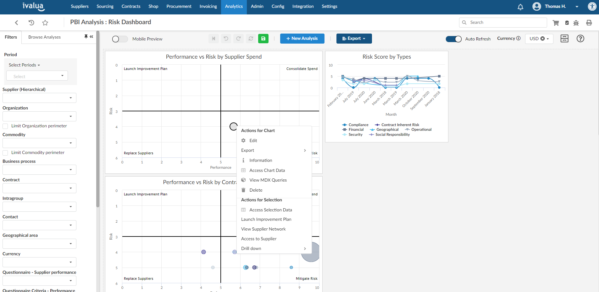

# Introduction about Ivalua

My journey as a Software Engineer began with Ivalua, where I had my first working experience (outside of internships). Starting my career in the Silicon Valley proved to be an excellent choice in hindsight. Ivalua is a French company with headquarters in Paris and Redwood City, California. They specialize in developing a procurement and spend platform tailored to the needs of their clients.
During my time at Ivalua, I worked at their Redwood City office for one year before moving to Paris, where I continued to work for them for another two years.

I was part of the Business Intelligence team, my role was to develop the chart display and its integration through the modules.

# Actionable Reports Feature Development at Ivalua

This feature was a critical component of our Business Intelligence module and was included in one of the software releases.

As the lead developer for this feature, I was responsible for designing and implementing it from start to finish. Actionable Reports allowed customers to take specific actions in other modules of the software directly from a chart in the Business Intelligence module. This feature was a game-changer for our clients, as it provided them with real-time data and enabled them to make more informed decisions.

It was a challenging project, but it allowed me to develop my technical and problem-solving skills, as well as my ability to work under pressure and deliver results on time.

For instance, customers could access specific suppliers from a bubble chart. To do so, they would simply right-click on the supplier bubble to open the context menu and select the action "Access to Supplier." This would then redirect them to the supplier page, allowing them to view additional details and take any necessary actions.

I'm proud of the work that I did on this feature, and I believe that it was a significant contribution. It allowed me to hone my technical and problem-solving skills, and it provided me with valuable experience working on a high-impact project.

# Working as a team, in an Agile environment

I was excited to learn about the Agile environment the company operated in. We had a dedicated Scrum Master, who guided us through the development process, and we worked in weekly sprints with daily standups. This approach allowed us to be highly adaptable and responsive to changing requirements and customer needs.

Working in a team was a new experience for me, but I quickly learned the importance of collaboration and communication. I was able to learn from my colleagues, who had more experience in the field, and I was able to contribute my own unique perspective to the projects we worked on. We all had different strengths and weaknesses, but we were able to come together to produce high-quality work.

The Agile approach also allowed us to work more efficiently and effectively. By breaking down projects into smaller, more manageable tasks, we were able to stay on track and make progress more quickly. This was especially important in the fast-paced environment of a software company, where things can change rapidly.

# Conclusion

During my three years at Ivalua, I was able to develop my technical and interpersonal skills while contributing to the success of the company's Business Intelligence module.

Overall, I am proud of the work that I did at Ivalua and grateful for the opportunities the company provided me. It was my first experience in the field of Software Engineering, and it was an excellent foundation for my career. I am excited to take the skills and knowledge I gained at Ivalua and apply them to future projects and opportunities.